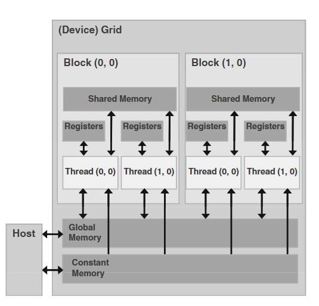

# CUDA Study

This repository aims to collect and develop fast CUDA kernels

---

## Parallelism Theory

Parallel algorithms have two costs:

**Work** $\Rightarrow$ total operations performed (like CPU Big-O)

**Depth (span)** $\Rightarrow$ longest dependency chain

A good parallel algorithm:
- keeps work $\approx O(N)$ 
- reduces depth $\approx O(\log N)$

> [!Insight]
>
> Prefix Sum
>
> Sequential definition:
>
> `prefix[i] = prefix[i-1] + a[i]`
>
> This creates a chain of length $N$
> 
> Parallel definition:
>
> You restructure dependencies so that each element depends on $\log N$ partial sums
>
> That's how you reduce depth. 
>
> Thus, the key GPU trick is always to **reduce dependency graph**. Not to parallelize the obvious formulation. 


## CUDA Hierarchy

CUDA hierarchy is a software abstraction, meaning it doesn't represent the hardware's physical layout. It's a way to conceptualize and manage parallel computations on the GPU.



**CUDA cores (hardware)**

**CUDA cores are physical execution units** on the GPU.

* Roughly comparable to ALUs on a CPU
* They execute **simple scalar instructions**
* You never address them directly

A modern NVIDIA GPU has:

* Thousands of CUDA cores
* Grouped inside **Streaming Multiprocessors (SMs)**

> Think: *CUDA cores are workers, SMs are factories.*

---

**Streaming Multiprocessor (SM)**

An **SM** is the basic execution unit of the GPU.

Each SM contains:

* CUDA cores
* Load/store units
* Registers
* Shared memory
* Warp schedulers

An SM:

* Runs **many warps at once**
* Hides memory latency by switching between warps

You don’t launch SMs — the hardware assigns work to them.

---

**Threads (programming model)**

A **thread** is:

> One execution of your kernel code

In CUDA:

* Each thread runs the same kernel function
* Each thread has:

  * its own registers
  * its own `threadIdx`
* Threads are *very lightweight* (much lighter than CPU threads)

Example:

```cpp
int tid = blockIdx.x * blockDim.x + threadIdx.x;
```

That expression gives **one thread one element** to work on.

---

**Warps (the critical concept)**

A **warp** is:

> A group of **32 threads** that execute **in lockstep**

This is **hardware reality**, not just an abstraction.

Inside a warp:

* All 32 threads execute the **same instruction**
* Different data (SIMT: Single Instruction, Multiple Threads)

### Important consequences

* If threads in a warp diverge (`if` branches):

  * The warp executes both paths serially
* Memory accesses are coalesced per warp
* Performance is measured in **warps**, not threads

> A warp is the smallest scheduling unit on an SM.

---

**Blocks (programming + scheduling unit)**

A **block** is:

> A group of threads that:
>
> * run on the **same SM**
> * can cooperate via **shared memory**
> * can synchronize (`__syncthreads()`)

Properties:

* Block size is chosen by *you*
* Common sizes: `128`, `256`, `512` threads
* A block is divided into **warps internally**

Example:

```cpp
<<<blocks, threads>>>
```

If `threads = 256`:

* That block contains:

  * `256 / 32 = 8 warps`

---

**Grid (full kernel launch)**

A **grid** is:

> All blocks launched for a kernel invocation

Example:

```cpp
<<<blocks, threads>>>
```

* `blocks` → number of blocks in the grid
* `threads` → number of threads per block

The GPU runtime:

* Distributes blocks across SMs
* Blocks are independent
* Order of execution is undefined

---

**How it all fits together**

Let’s say:

```cpp
threads = 256;
blocks  = 1024;
```

You launch:

* **1024 blocks**
* Each block has **256 threads**
* Each block has **8 warps**
* Total warps = `1024 × 8 = 8192 warps`

At runtime:

* Each SM:

  * Pulls some blocks
  * Executes their warps
  * Time-slices warps to hide latency
* CUDA cores execute instructions for one warp at a time

---

**Visual Representation**

```
Grid
 ├─ Block 0
 │   ├─ Warp 0 (32 threads)
 │   ├─ Warp 1 (32 threads)
 │   └─ ...
 ├─ Block 1
 │   ├─ Warp 0
 │   └─ ...
 └─ Block N
```

Inside an SM:

```
SM
 ├─ Warp Scheduler
 │   ├─ Warp A → CUDA cores
 │   ├─ Warp B → waiting on memory
 │   └─ Warp C → ready
```

---

**CPUs VS GPUs**

| CPU                     | GPU                         |
| ----------------------- | --------------------------- |
| Few heavyweight threads | Massive lightweight threads |
| Big caches              | Latency hidden by warps     |
| Branch prediction       | Warp divergence penalty     |
| MIMD                    | SIMT                        |

GPUs win by **throwing parallelism at the problem**.

---

**Key takeaways**

* **Thread**: one kernel instance
* **Warp**: 32 threads executing together
* **Block**: group of threads on one SM
* **Grid**: all blocks in a launch
* **CUDA cores**: hardware that executes warp instructions
* **SM**: runs and schedules warps

If you understand **warps**, everything else makes sense.

---
### CUDA Concepts


`__shared__` memory is per block

Threads in one block can cooperate

Threads in different blocks cannot

Therefore: a single kernel cannot compute a global dot product in one pass


`__syncthreads()` only synchronizes within a block


`warp-shuffle`

Warp shuffle refers to CUDA instructions that allow threads inside the same warp to directly read registers from other threads in that warp.
- Writing to shared memory
- Synchronizing
- Reading back

You can directly move values between registers across threads.

This is:
- Faster than shared memory
- No explicit __syncthreads() needed
- Low latency

`__shfl_down_sync` is a CUDA intrinsic that performs a warp shuffle operation, shifting values "down" across threads.

## References

https://developer.nvidia.com/gpugems/gpugems3/part-vi-gpu-computing/chapter-39-parallel-prefix-sum-scan-cuda

- Hillis and Steele scan
- Blelloch scan
- Brent-Kung Algorithm
- Kogge-Stone Algorithm

## Next Topics

- Parallel Sorting
- Parallel DP (like KS, or Git diff LCS) and recurrences